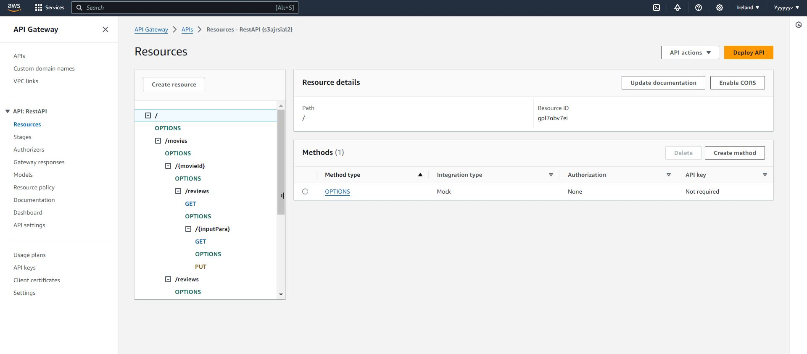
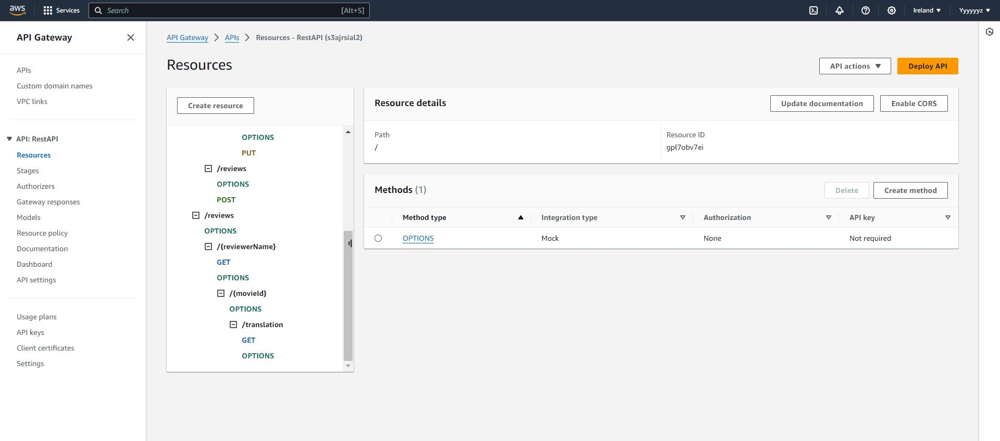
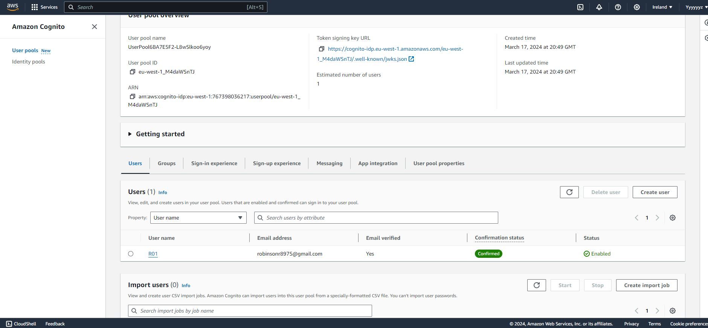
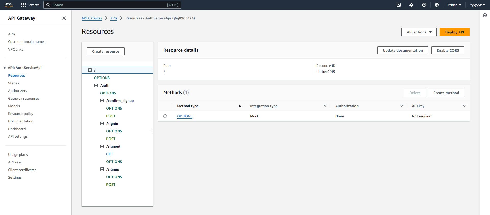

## Serverless REST Assignment.

__Name:__ Yuanzhe Yang

__Video demonstration:__ https://youtu.be/ge4VE6qb5Bs, https://youtu.be/LMtjOY5WEOs, https://youtu.be/co6g1MBfnSc (As the size of video is too large to upload, so I split into three parts.)

This repository contains an implementation of a serverless REST API for the AWS platform. The CDK framework is used to provision its infrastructure. The API's domain context is movie reviews.

### API endpoints.

[ Provide a bullet-point list of the app's endpoints (excluding the Auth API endpoints you have successfully implemented in full. Omit those in the assignment specification that you did not complete.]
e.g.

+ GET /movies/{movieId}/reviews  - Get all the reviews for the specified movie.
+ GET /movies/{movieId}/reviews?minRating=n - Get the reviews for the specified movie with a rating greater than the minRating.
+ GET /movies/{movieId}/reviews/{reviewerName} - Get the review written by the named reviewer for the specified movie.
+ GET /movies/{movieId}/reviews/{year} - Get the reviews written in a specific year for a specific movie.
+ GET /reviews/{reviewerName} - Get all the reviews written by a specific reviewer.
+ GET /reviews/{reviewerName}/{movieId}/translation?language=code - Get a translated version of a movie review using the movie ID and reviewer name as the identifier.
+ POST /movies/reviews - add a movie review.
+ PUT /movies/{movieId}/reviews/{reviewerName} - Update the text of a review.

[Include screenshots from the AWS management console (API Gateway service) that clearly show the deployed API ( ensure the font size is legible). ]

### Authentication (if relevant).

[Include a screenshot from the AWS management console (Cognito User Pools) showing a confirmed user account.]

### Independent learning (If relevant).

[ Briefly explain any aspects of your submission that required independent research and learning, i.e. typically related to the higher grade bands. State the source files that have evidence of this.]
+ https://completecoding.io/typescript-translation-api/
+ https://serverlessland.com/patterns/apigw-lambda-translate-cdk
+ https://serverlessland.com/patterns/apigw-lambda-translate
+ https://docs.aws.amazon.com/translate/latest/dg/what-is.html

